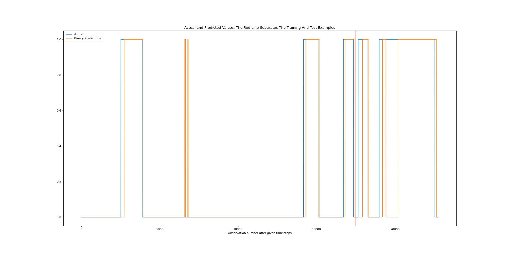
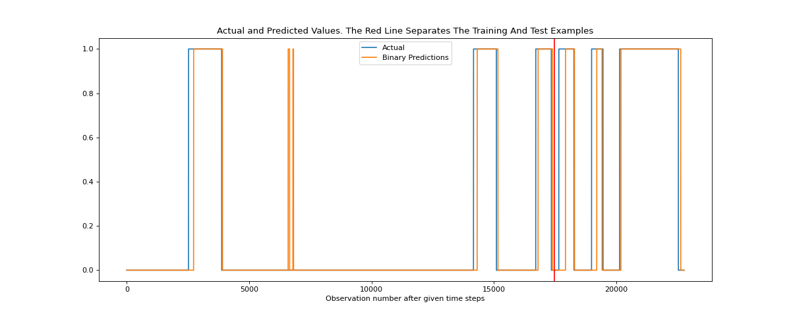

## What is this

This is a real world application of a Recurrent Neural Network on a binary classification of time series data. This project includes data cleanup, model creation, fitting, and testing/reporting and was designed and analysed in less than 24 hours.

## Challenge and input

Three input files were provided for this challenge:

- aigua.csv
- aire.csv
- amoni.csv (amoni_pred.csv is the same thing with integers rather than booleans)

The objective is to train a Machine Learning classifier that can predict dangerous drift on amoni.

## Analysis procedure

`Gretl` has benn used to analyze the data.

Ideally, fuzzing techniques would be applied that would remove the input noise on amoni from the correlation with `aigua.csv` and `aire.csv`. After many hours of analysis I decided that the input files `aire.csv` and `aigua.csv` did not provide enough valuable data.

After much analysis of the `amoni.csv` file, I identified a technique that was able to remove most of the noise.

The technique has been implemented into the `run.py` file. This file cleanups up the data on `amoni_pred.csv`. It groups data by time intervals and gets the mean. It removes values that are too small. It clips the domain of the values. It removes noise by selecting the minimum values in a window slice. And (optionally) it corrects the dangerous drift values.

## Generating the model

Once the file `amoni_pred_base.csv` has been created after cleaning up the input, we can move on to generating the model. Models are created and trained by the `pred.py` file. This file creates a Neural Network architecture with Recurrent Neural Networks (RNN). To be more precise, this NN has been tested with SimpleRNN and Long Short Term Memory (LSTM) layers. LSTM were chosed because they were seen to converge faster and provide better results and flexibility.

The input has been split on train/test sets. In order to test the network on fully unknown intervals, the test window time *is non overlapping* with the train window.

In order to allow prediction of a value, a window time slice is fed on to the LSTM layers. This window *only* includes past values and does not provide a lookahead cheat opportunity. The model is trained with checkpoints tracking testing accuracy. Loss and accuracy graphs are automatically generated for the training and testing sets.

## Testing the models

After the models have been generated, the file `test.py` predicts the drift and dangerous values on the input data, It also provides accuracy metrics and saves the resulting file `output.csv`. This file can then be analysed with `Gretl`.

## Performance

Our models are capable of achieving:

- ~ 75% Accuracy on dangerous drifts with minimal time delays
- ~ 80% Accuracy on drifts with minimal time delays

Moreover, with the set of corrections of the dangerous drift input values explained in previous sections, *our model can achieve*:

- ~ 87% Accuracy *on dangerous drifts* with minimal time delays

## Future Work / Improvements

Many improvements are possible on this architecture. First of all, fine tuning of the hyper parameters (clean up data set values, NN depth, type of layers, etc) should all be considered. Furthermore, more data should be collected, because the current data set only provides information for ~ 8 drifts. On top of that, more advanced noise analysis techniques should be applied, like fuzzing, exponential smoothing etc.

## Other possible techniques

Yes, Isolation Forests are probably a better idea. But LSTM layers are cool :)

## Show me some pictures

In blue, expected dangerous drift predictions. In orange the prediction by the presented model.

Furthermore, with the patched dangerous drift patch:

